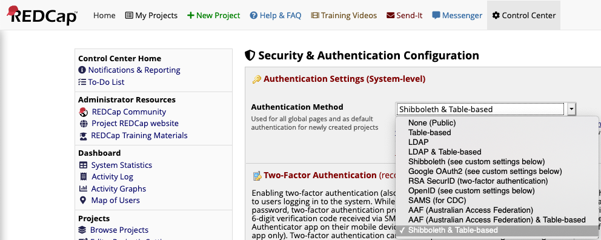

# shibboleth_and_table_auth
A patch to REDCap to allow shibboleth and table-based authentication

# Overview
Takes a REDCap zip file (referred to throughout this document as `redcapN.M.O.zip`, `N`, `M`, and `O` being version numbers) and patches it to add the ability to simultaneously support Shibboleth and table-based users. Shibboleth users who do not already exist in REDCap will be prompted to create an account and will be able to log in after (provided whitelisting is not turned on). Table based users can be created as usual under the Control Center.

# Requirements
Access to a terminal running bash.

# Instructions
Download a redcap zip file, e.g. from the [REDCap community site](https://community.projectredcap.org/page/download.html) and copy it into the same directory that you downloaded this repository to. If needed, alter the `REDCAP_VERSION` and `REDCAP_PATCH_VERSION` to reflect the version of REDCap you are patching, and the patch file (if there are multiple patch versions, use the closest one to the version of your REDCap zip file).  

Run the following command:

```bash
bash apply_patch.sh
```

The program will report if the patch worked or if there was an issue. Once finished, if the program was successful, your `redcapN.M.O.zip` file will contain the changes needed to enable the use of Shibboleth and Table login functionality.

## If you are launching this version of REDCap for the first time
Use the zip file to launch your REDCap site as you normally would.

## If you currently have this version of REDCap running and want to add Shibboleth and Table functionality to it
You will need to overwrite your existing files with the updated ones.

## After your REDCap is launched or updated
You will need to update the database if you want to support the new customization fields. A SQL script has been provided for this in your `redcapN.M.O.zip` file under `redcap/redcap_vN.M.O/sql.shibboleth_table_customizations.sql` as a separate file. This file will need to be run _on your REDCap server_ to enable changing. An example is provided assuming: your version is `9.1.1` and that you are in your `redcap` directory _on your REDCap server_ as a user with priviliges to alter the database.

```bash
mysql < redcap_v9.1.1/Resources/sql/shibboleth_table_customizations.sql
```

# Usage
After the patch has been applied and the database has been updated, on your REDCap site, navigate to Control Center > Security & Authentication. The Authentication Method dropdown menu will have a new entry, `Shibboleth & Table-based`, select it.  


Scroll further down on the same page to a section titled `Additional Shibboleth Authentication Settings`, this section  will control the functionality of both Shibboleth and Shibboleth & Table options, the section below controls the login page presented while using Shibboleth and Table option.

  
**Shibboleth Username Login Field**: The value that is provided by the server containing your Shibboleth login ID. If your institution does not use one of the values in the dropdown menu, select `other` and a text box will appear allowing you to enter the correct value. If the value you have entered is not found, it will default to functioning as if you had chosen `None`.  
**URL for Shibboleth Logout Page**: This should be set to `/Shibboleth.sso/Logout`. This will redirect users to the server's Shibboleth logout page. You can add [parameters to alter its behavior](https://wiki.shibboleth.net/confluence/display/SHIB2/NativeSPLogoutInitiator). In this example, `return=/stage_c/` redirects users to the server's `stage_c` address on logout.

  
1. **Default login method**: Controls which option users are first presented with upon navigating to your REDCap website. `Shibboleth` or `Table`. Users can change this by clicking on the tab for the other option.
2. **Shibboleth Link Image URL**: Controls the image presented to users to click to login via Shibboleth.
3. **Shibboleth login selection title**: Controls the text displayed in the tab used to display Shibboleth login.
4. **Table login selection title**: Controls the text displayed in the tab used to display table-based login.
5. **Shibboleth login descriptive text**: Controls optional text to be displayed above the image provided by **Shibboleth Link Image URL**.

